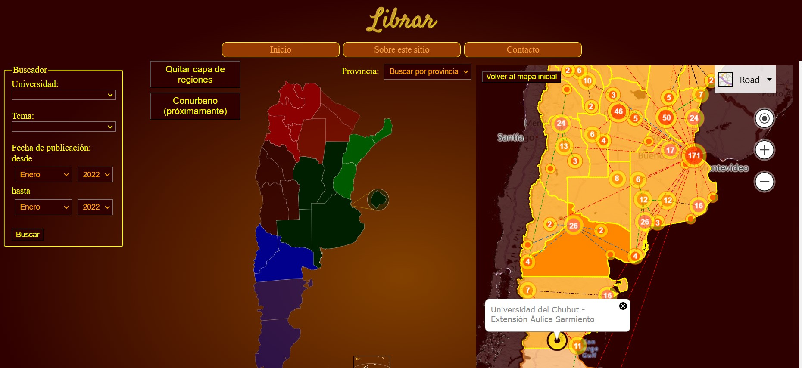
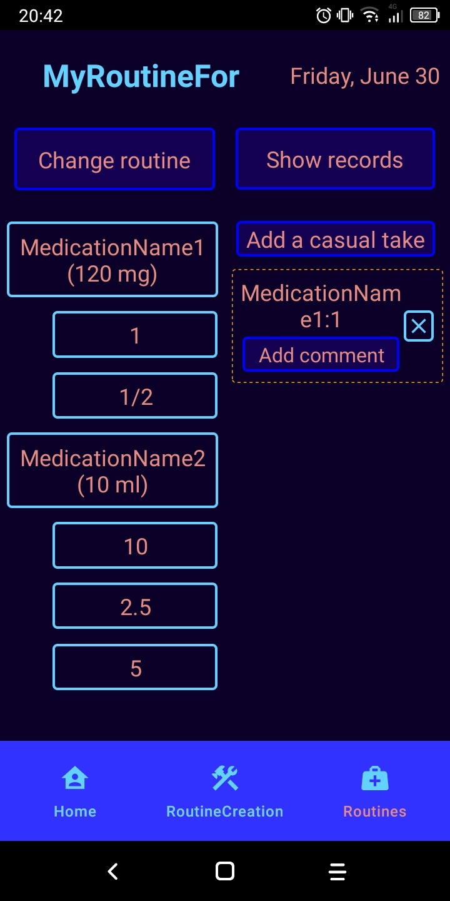

<a href="https://github.com/chonydev/corriente_backend">Forum express backend</a>

<a href="https://youtu.be/yz7a_MPTXj8">Librar web: interactive map (youtube video)</a>

 
  

<a href="https://youtu.be/fYePS0zZ_yU">Medtakes: React Native app (youtube video)</a>

         
          

    

<h2>  Techs  </h2>

###  WebDev
<table>
    <tr>
        <td>
            
        </td>
        <td>
            
        </td>
        <td>
            
        </td>
        <td>
            
        </td>
        <td>
            
        </td>
        <td>
            
        </td>
        <td>
            
        </td>
        <td>
            
        </td>
    </tr>
    </table>
    <h3>MobDev: Android (through JS)</h3>
    <table>
    <tr>
        <td>
            
        </td>
        <td>
            
        </td>
    </tr>
    </table>
    <h3>DB</h3>
    <table>
    <tr>
        <td>
            
        </td>
        <td>
            
        </td>
        <td>
            
        </td>
    </tr>
    </table>
    <h3>DS</h3>
    <table>
    <tr>
        <td>
            
        </td>
        <td>
            
        </td>
        <td>
            
        </td>
        <td>
            
        </td>
        <td>
            
        </td>
        <td>
            
        </td>
        <td>
            
        </td>
        <td>
            
        </td>
    </tr>
    </table>
    <h3>Others</h3>
    <table>
    <tr>
        <td>
            
        </td>
    </tr>
    </table>
