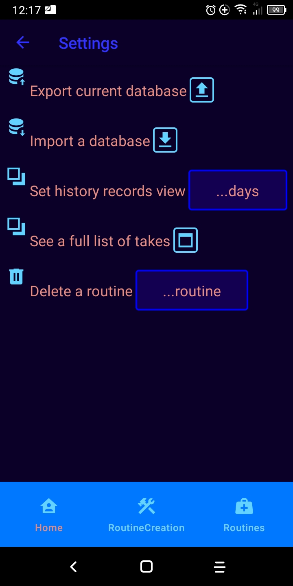
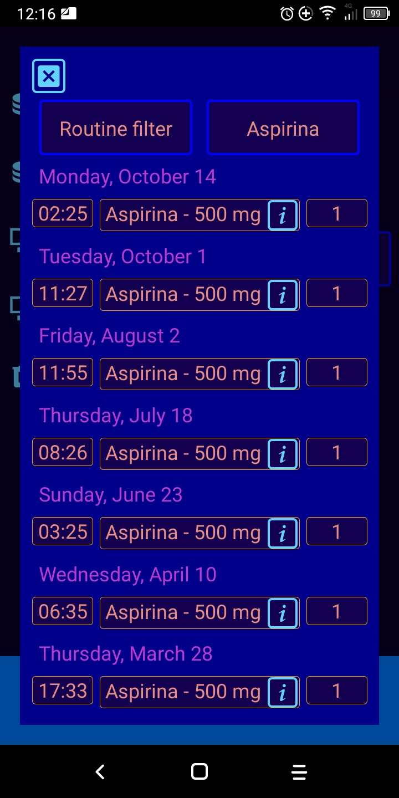
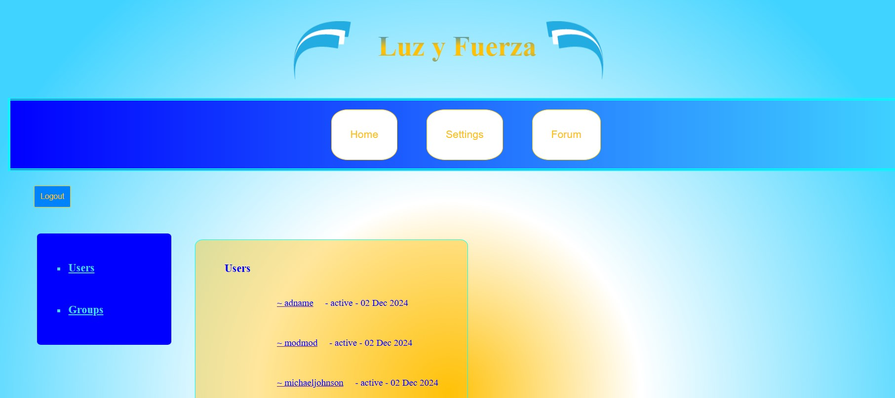

<h1 align="center" style='color:rgb(200, 120, 20)'>ChonyDev</h1>

<h2>
    <a href="https://youtu.be/yz7a_MPTXj8">
        
        Librar web: interactive map (YT video)
    </a>
</h2>

<h2>
    <a href="https://youtu.be/fYePS0zZ_yU" '>
    
        Medtakes: React Native app (YT video)
    </a>
</h2>

    
    
    

<h2>Forum web</h2>

<h3>
    <a href="https://github.com/chonydev/corriente_backend">
        
        Backend: Express (repo)
    </a>
</h3>
<h3>
    <a href="https://github.com/chonydev/corriente_frontend">
        
        Frontend: Angular (repo)
    </a>
</h3>

<h2>  Techs  </h2>

<h3> WebDev </h3>
<table>
    <tr>
        <td>
            
        </td>
        <td>
            
        </td>
        <td>
            
        </td>
        <td>
            
        </td>
        <td>
            
        </td>
        <td>
            
        </td>
        <td>
            
        </td>
        <td>
            
        </td>
    </tr>
</table>

<h3>MobDev: Android (through JS)</h3>
<table>
    <tr>
        <td>
            
        </td>
        <td>
            
        </td>
    </tr>
</table>

<h3>DB</h3>
<table>
    <tr>
        <td>
            
        </td>
        <td>
            
        </td>
        <td>
            
        </td>
    </tr>
</table>

<h3>DS</h3>
<table>
    <tr>
        <td>
            
        </td>
        <td>
            
        </td>
        <td>
            
        </td>
        <td>
            
        </td>
        <td>
            
        </td>
        <td>
            
        </td>
        <td>
            
        </td>
        <td>
            
        </td>
    </tr>
</table>

<h3>Others</h3>
<table>
    <tr>
        <td>
            
        </td>
    </tr>
</table>
